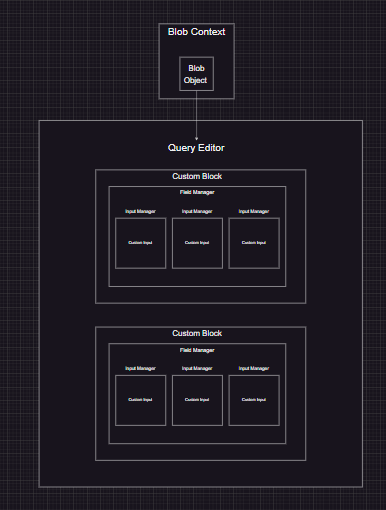

import { Tab, Tabs } from 'nextra-theme-docs'

## Query Builder
<br/>


<div style={{ display: 'flex' , flexDirection: 'row', justifyContent: 'center' }}>
  <iframe width="560" height="315" src="https://www.youtube.com/embed/dQw4w9WgXcQ" frameborder="0" allow="autoplay; encrypted-media" allowfullscreen></iframe>
</div>


## Table of Contents

- [Overview](#overview)
- [Highlights](#highlights)
- [Goals](#goals)

- [Data Encoding & Decoding](#data-encoding--decoding)
  - [Base 64 Encoding](#base-64-encoding)
  - [Blob](#blob-encoding)
  - [JSON Serialization](#json-encoding)
- [React & OOP](#react--oop)
  - [React](#react)
  - [OOP](#oop)


- [Serialization](#serialization)
- [Design Patterns](#design-patterns)
- [Binary Operators](#binary-operators)


### Overview 


### Highlights


### Goals


### Data Encoding & Decoding

##### Overview 




I found that by attaching my BlobGenerator class to a ref in the parent context I would be able handle the complex state management of my BlobGenerator class.
<details>
      <summary>Code Examples Stripped of Documentation</summary>
```javascript
export type ChildBlob = {
  template: string;
  blobUrl: string;
  blobName: string;
  blobId: string;
  blob: Blob;
  parentBlockId?: string;
  info?: string

}

class BlobGenerator {
  blobId: string;
  blobName: string;
  owner: string
  content: string;
  ownerName?: string;
  childrenBlocks: ChildBlob[];
  blobUrl: string;
  template: string;
  blob: Blob;
  templateEditor: { [key: string]: any };


  constructor(blobId: string, blobName: string, owner: string, content: string) {
    this.blobId = blobId;
    this.blobName = blobName;
    this.owner = owner;
    this.content = content;
    this.ownerName = blobName;
    this.childrenBlocks = [];
    this.template = `Template__${this.ownerName}`;
    this.blob = new Blob([this.content], { type: "text/plain" });
    this.blobUrl = URL.createObjectURL(new Blob([this.content], { type: "text/plain" }));
    this.templateEditor = {};
  }

  generateChildBlob(parentBlockId: string, content: string) {
    const childBlob = {
      template: `Template__${this.ownerName}`,
      parentBlockId: parentBlockId,
      blob: new Blob([content], { type: "text/plain" }),
      blobUrl: URL.createObjectURL(new Blob([content], { type: "text/plain" })),
      blobId: `${this.blobId}_${parentBlockId}`,
      blobName: `${this.blobName}_child`

    };
    this.childrenBlocks.push(childBlob);
    return childBlob;

  }

  edit(content: string) {
    this.blob = new Blob([content], { type: "text/plain" });
    this.blobUrl = URL.createObjectURL(new Blob([content], { type: "text/plain" }));
  }


  append(parentBlockId: string, content: string) {
    // Search for child block with the specified parentBlockId
    const childBlock = this.childrenBlocks.find((block) => block.parentBlockId === parentBlockId);
    if (childBlock) {
      const reader = new FileReader();
      reader.onload = (event) => {
        const currentBlob = childBlock.blob;
        const newBlob = new Blob([currentBlob, event.target!.result as ArrayBuffer], { type: "text/plain" });
        childBlock.blob = newBlob;
        URL.revokeObjectURL(childBlock.blobUrl); // Revoke old URL
        childBlock.blobUrl = URL.createObjectURL(newBlob); // Create new URL with updated content

      };
      reader.readAsArrayBuffer(new Blob([content], { type: "text/plain" }));
    } else {
      console.log(`No child block found with parentBlockId = ${parentBlockId}`);
    }
  }


  //append without changing url
  appendWithoutUrlChange(content: string) {
    const currentBlob = this.blob;
    const newBlob = new Blob([currentBlob, content], { type: "text/plain" });
    this.blob = newBlob;
    console.log("Append content to blob");
    console.log("Size:", newBlob.size);
    console.log("content:", content);
  }


  async inspectChildBlob(blockId: string) {
    // Find the child block with the specified blockId
    const childBlock = this.childrenBlocks.find((block) => block.parentBlockId === blockId);
    if (childBlock) {
      const content = await this.getContentFromUrl(childBlock.blobUrl);
      return content;
    } else {
      console.log(`No child block found with blockId = ${blockId}`);
      return undefined;
    }
  }

  revokeAllBlobs() {
    URL.revokeObjectURL(this.blobUrl);
    this.childrenBlocks.forEach((childBlock) => {
      URL.revokeObjectURL(childBlock.blobUrl);
    });
  }

  replaceContent(content: string) {
    const reader = new FileReader();
    reader.onload = (event) => {
      const newBlob = new Blob([event.target!.result as ArrayBuffer], { type: "text/plain" });
      URL.revokeObjectURL(this.blobUrl); // Release existing URL
      this.blob = newBlob; // Update blob content
      this.blobUrl = URL.createObjectURL(newBlob); // Create new URL with updated content

      if (this.owner === 'parent') {
        console.log("Replace content of blob");
        console.log("owner:", this.owner);
        console.log("blobId:", this.blobId);
        console.log("Size:", newBlob.size);
        console.log("content:", content);
        console.log('blobURl:', this.blobUrl);
      }
    };
    reader.readAsArrayBuffer(new Blob([content], { type: "text/plain" }));
  }

  replaceChildContent(parentBlockId: string, content: string) {
    // Search for child block with the specified parentBlockId
    const childBlock = this.childrenBlocks.find((block) => block.parentBlockId === parentBlockId);
    if (childBlock) {
      const reader = new FileReader();
      reader.onload = (event) => {
        const newBlob = new Blob([event.target!.result as ArrayBuffer], { type: "text/plain" });
        URL.revokeObjectURL(childBlock.blobUrl); // Release existing URL
        childBlock.blob = newBlob; // Update child block content
        childBlock.blobUrl = URL.createObjectURL(newBlob); // Create new URL with updated content
        console.log("Content:", content);
      };
      reader.readAsArrayBuffer(new Blob([content], { type: "text/plain" }));
    } else {
      console.log(`No child block found with parentBlockId = ${parentBlockId}`);
    }
  }


  addInfoToChildBlob(parentBlockId: string, info: string) {
    // Search for child block with the specified parentBlockId

    const childBlob = this.childrenBlocks.find((block) => block.parentBlockId === parentBlockId);
    if (childBlob) {
      childBlob.info = info;
    } else {
      console.log(`No child block found with parentBlockId = ${parentBlockId}`);
    }

  }

  //get content from url
  async getContentFromUrl(url: string) {
    const response = await fetch(url);
    const text = await response.text();
    return text;
  }

  writeToBlobUrl(content: string) {
    const newBlob = new Blob([content], { type: "text/plain" });
    this.blob = newBlob;
    this.blobUrl = URL.createObjectURL(newBlob);
    console.log("Write content to blob");
    console.log("Size:", newBlob.size);
    console.log("content:", content);
  }


  deleteChildBlob(blobId: string) {
    const index = this.childrenBlocks.findIndex((blob) => blob.parentBlockId === blobId);
    if (index !== -1) {
      this.childrenBlocks.splice(index, 1);
    }
  }

  combineChildBlobs() {
    const reader = new FileReader();
    reader.onload = (event) => {
      const newBlob = new Blob([event.target!.result as ArrayBuffer], { type: "text/plain" });
      URL.revokeObjectURL(this.blobUrl); // Release existing URL
      this.blob = newBlob; // Update blob content
      this.blobUrl = URL.createObjectURL(newBlob); // Create new URL with updated content
      // console.log("Combine child blobs");
      // console.log("Size:", newBlob.size);
      // console.log("Blob URL:", this.blobUrl);
    };
    const childBlobs = this.childrenBlocks.map((block) => block.blob);
    const blob = new Blob(childBlobs, { type: "text/plain" });
    reader.readAsArrayBuffer(blob);
    return this.blobUrl;

  }

  readCombinedChildBlobs() {
    return new Promise((resolve, reject) => {
      const reader = new FileReader();
      reader.onload = (event) => {
        const newBlob = new Blob([event.target!.result as ArrayBuffer], { type: "text/plain" });
        const content = event.target!.result;
        URL.revokeObjectURL(this.blobUrl); // Release existing URL
        this.blob = newBlob; // Update blob content
        this.blobUrl = URL.createObjectURL(newBlob); // Create new URL with updated content
        // console.log("Combine child blobs");
        // console.log("Size:", newBlob.size);
        // console.log("Blob URL:", this.blobUrl);

        resolve(content);
      };

      const childBlobs = this.childrenBlocks.map(childBlock => childBlock.blob);
      // console.log("childBlobs:", childBlobs);
      const blob = new Blob(childBlobs, { type: "text/plain" });
      reader.readAsText(blob);
    });
  }

  changeBlobName(newName: string) {
    this.blobName = newName;
  }
  addTemplateEditor(payload: any, blockId: string) {
    this.templateEditor[blockId] = payload;
  }

}

export default BlobGenerator;


```
 </details>


1. Create a multi layered component structure where each parent controls the state of the child component. 
  - This is a common pattern in React, but I wanted to take it a step further. 
* Step 2
* Step 3


<details>
  <summary>Control Details</summary>

  
   


</details>


<br />


#### Base 64 Encoding


#### Blob Encoding


#### JSON Encoding


### React & OOP


#### React


#### OOP


### Serialization


### Design Patterns


