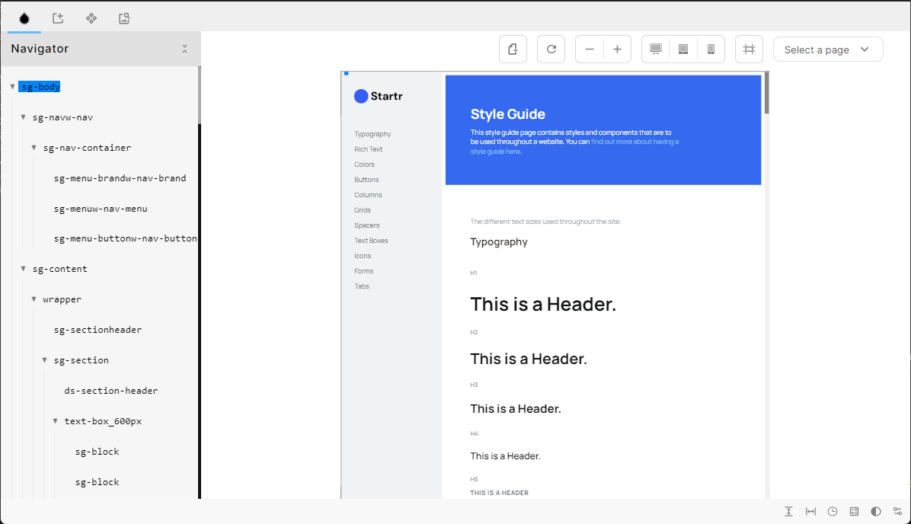
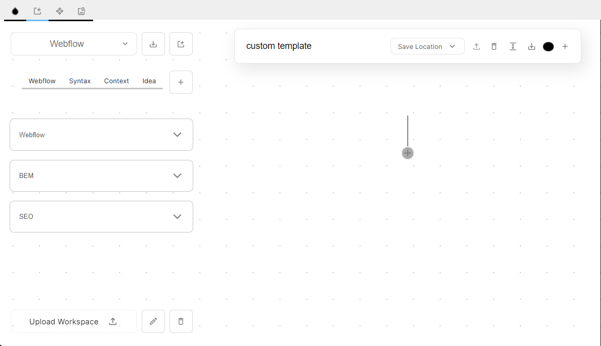
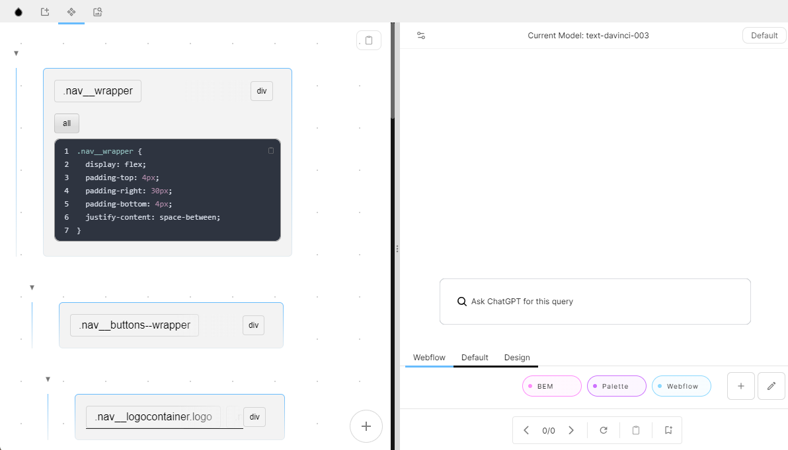
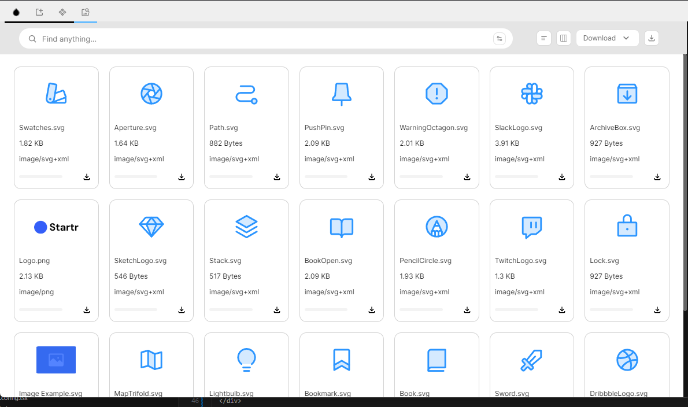
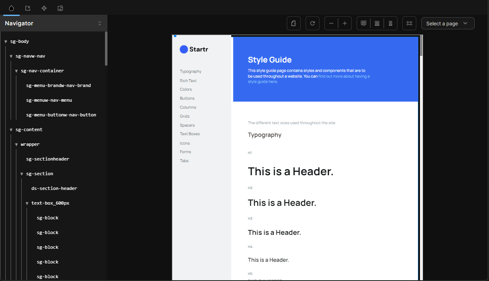
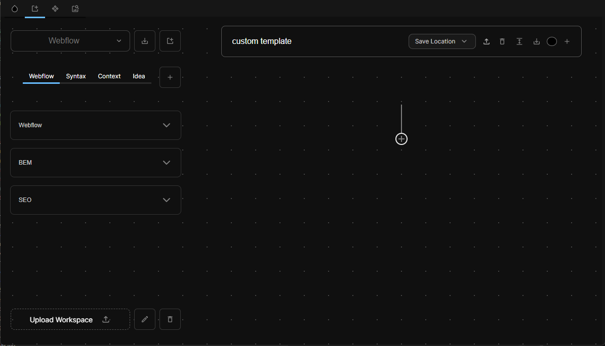
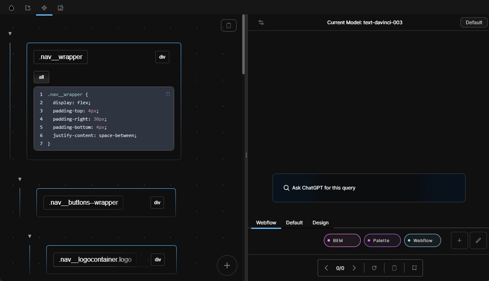
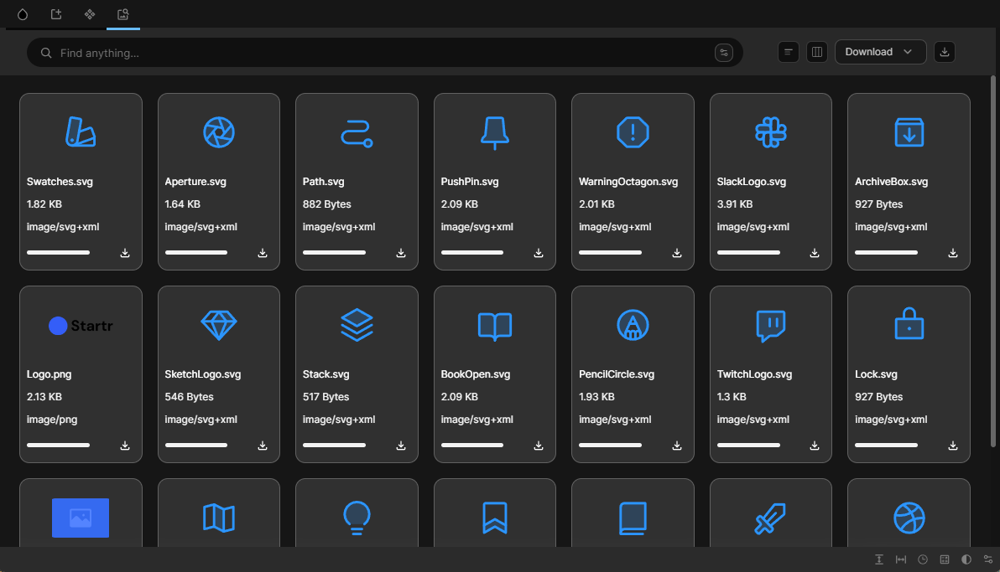

import YoutubePlayer from '../components/Youtube/YoutubePlayer';
import styles from './styles/Index.module.css';
import { Tab, Tabs } from 'nextra-theme-docs'
import ImageGrid from '../components/Slider/ImageGrid';

 

## 🌟 Overview
Welcome to my Engineering journal for FlowKit!

This is where I write about my thought process, my learnings, and my experiences. To begin, let's dive into the main features of FlowKit. 

If you want to follow along you can download the extension here : [Flowkit](https://chrome.google.com/webstore/detail/flowkit/kkoecihmpjfkfpfkffgiohcniepmdhif?hl=en&authuser=0)

Currently the codebase is private but upon request I can share it with you.

## 🚀 Features

For the sake of Brevity I will only be covering the main highlighted features of FlowKit in the docs.

1. **Webflow x GPT** 
2. **Query Template Builder**
3. **Style Guide Reference** 
4. Asset Manager 
5. Css search 
6. Tree-Explorer 
7. Todo List
8. Rem Calculator
9. Pomodoro Timer

[See the Project Live!](https://chrome.google.com/webstore/detail/flowkit/kkoecihmpjfkfpfkffgiohcniepmdhif?hl=en&authuser=0)

 

<Tabs items={['Light' , 'Dark']}>
  <Tab>
    

      

  

  

  

  

  

  

  

   
  

  
    

  </Tab>
    <Tab>
    

      

     

        

  

  

  

  

  

  

   
  

    

  </Tab>
</Tabs>

### Webflow x GPT 
 
<YoutubePlayer
  videoId="TYPYqmoXZDI"
  chapters={[
    { name: 'Live Tree Intro', start: 0, end: 60, description: 'CSS preview is shown that emulates the Webflow DOM' },
    { name: 'Webflow Template Demo', start: 61, end: 20, description: 'A Demo of Webflow to React template ' },
    { name: 'Custom Interpreter', start: 153 , end: 204 , description: 'A Demo of the BEM classname suggestion Interpreter' },
  ]}
>
<Tabs items={['Overview']}>
  <Tab>
    

      
Overview

    The integration of Webflow with generative AI, specifically large language models, brings exciting possibilites of Weblow x GPT. 
    
    Through this integration, users can leverage the power of AI to interpret and manipulate Webflow elements in real-time. The demonstration showcases a live preview of selected elements, providing a comprehensive view of the tree structure, combo classes, CSS, and media queries.

By utilizing a custom template, developers can convert Webflow data into React components and gain class name suggestions based on various architectural philosophies. 

The possibilities are endless, the temlates are very flexible and can be easily shared with the community.
    

  </Tab>
    <Tab>
    

      
Overview

      sdsdsd
    

  </Tab>
</Tabs>

</YoutubePlayer>

 
 
 

### Query Template Builder  

<YoutubePlayer
  videoId="F-teerojMaQ"
  chapters={[
    { name: 'Intro/Demo', start: 0, end: 10, description: 'A demo of critical features to give some broader perspective of what is possible.' },
    { name: 'Worskpace Blocks', start: 145 , end: 180, description: 'A demo of how templates can be used as resusable blocks for quick and efficient development' },
    { name: 'Implementation Details', start: 182, end: 287, description: 'A discussion of the strategy behind implementing a custom tempalte editor along with multi media encoding/ serialization' },
  ]}
>
<Tabs items={['Overview' ]}>
  <Tab>
    

      
Overview

The Template Builder is a feature that simplifies the creation of customizable templates by embedding various data sources, including webflow elements. Users can insert query variables from different data types and specify output formats. 

Templates can be saved as reusable blocks, organized in the workspace, and integrated into webflow. Implementation involves a custom Blob Builder class for efficient data manipulation, while a serializer ensures compatibility with different data sources. The Template Builder streamlines the template creation process, enhancing productivity and flexibility.
    

  </Tab>
    <Tab>
    

      
Overview

      sdsdsd
    

  </Tab>
</Tabs>

</YoutubePlayer>

 
 
 

### Styleguide Reference 

<YoutubePlayer
  videoId="YKfceotShXQ"
  chapters={[
    { name: 'Intro', start: 0, end: 60, description: 'An intro into Styleguide reference feature' },
    { name: 'Investigation', start: 61, end: 99, description: 'Exploration of multiple different ways to investigate the webflow page to use as a reference. ' },
    { name: 'Summary', start: 100, end: 134, description: 'A summary of why this feature was built and why it can be useful.' },
  ]}
>
<Tabs items={['Overview' ]}>
  <Tab>
    

      
Overview

      The Style Guide Reference is a feature designed to streamline the process of referencing and utilizing design systems within Webflow. It provides a pop-out window that replicates the Webflow page, allowing designers to easily select elements and copy their associated class names.

The feature offers different methods of investigating and referencing the Webflow page. These include a recursive tree structure that emulates the DOM, direct element selection on the page, and the ability to explore different devices through media queries.
    

  </Tab>
    <Tab>
    

      
Overview

      sdsdsd
    

  </Tab>
</Tabs>

</YoutubePlayer>

